- [一，数字图像基础](#一数字图像基础)
  - [1.1，视觉感知要素](#11视觉感知要素)
    - [1.1.1，人眼的结构](#111人眼的结构)
    - [1.1.2，人眼中图像的形成](#112人眼中图像的形成)
    - [1.1.3，亮度适应与辨别](#113亮度适应与辨别)
  - [1.2，电磁波谱](#12电磁波谱)
  - [1.3，图像感知与获取](#13图像感知与获取)
    - [1.3.1，一个简单的成像模型](#131一个简单的成像模型)
  - [1.4，图像取样和量化](#14图像取样和量化)
    - [1.4.1，取样和量化的概念](#141取样和量化的概念)
    - [1.4.2，数字图像表示](#142数字图像表示)
  - [1.5，像素间的一些基本关系](#15像素间的一些基本关系)
  - [1.6，数字图像处理所用的基本数学工具](#16数字图像处理所用的基本数学工具)
    - [1.6.1，对应元素运算和矩阵运算](#161对应元素运算和矩阵运算)
    - [1.6.2，线性运算和非线性运算（一般两个图像之间）](#162线性运算和非线性运算一般两个图像之间)
    - [1.6.3，数字图像处理数学工具-算术运算（一般两个图像之间）](#163数字图像处理数学工具-算术运算一般两个图像之间)
    - [1.6.4，集合运算和逻辑运算（一般两个图像之间）](#164集合运算和逻辑运算一般两个图像之间)
    - [1.6.5，空间运算（单幅图像）](#165空间运算单幅图像)
      - [1.6.5.1，单像素操作](#1651单像素操作)
      - [1.6.5.2，领域运算](#1652领域运算)
      - [1.6.5.3，几何变换](#1653几何变换)
## 一，数字图像基础

**相机成像的原理**：针孔相机( Pinhole Camera )通过投影变换，可以将三维相机（Camera）坐标转换为二维的图像坐标，这个变换矩阵是相机的内在属性，称为相机内参（Camera Intrinsic） K。
> yaw 航向角，pitch 俯仰角，roll 翻滾角。

### 1.1，视觉感知要素

通过这节内容了解图像被人类感知的基本原理及人类视觉的物理限制。

#### 1.1.1，人眼的结构

下图显示了人眼的简化剖面图。

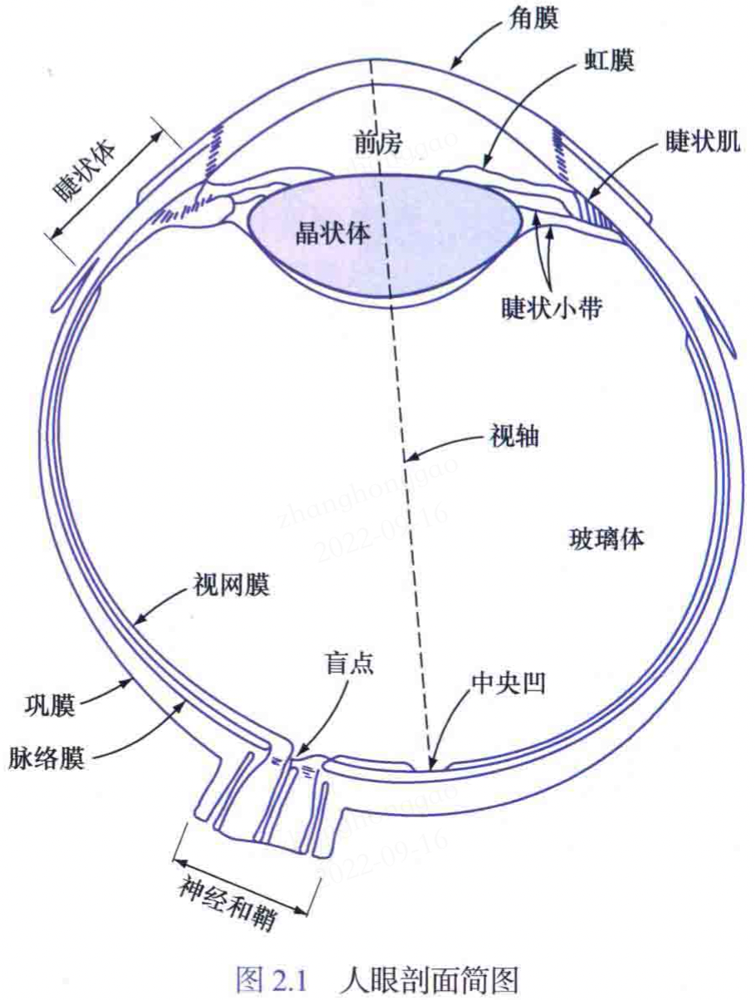

眼镜最靠内部的膜是视网膜，它布满了整个后部的内壁。眼睛聚焦时，来自物体的光在视网膜上成像。模式视觉由分布在视网膜表面上的哥哥分立光感受器提供，分为两类：锥状体和杆状体。锥状体视觉称为**明视觉或亮视觉**。杆状体视觉称为**暗视觉或微光视觉**。

#### 1.1.2，人眼中图像的形成

数码相机中，既有固定焦距的镜头，也有可变焦距的镜头，不同距离的聚焦时通过**改变镜头和成像平面之间的距离**来实现的。在人眼中，晶状体和成像区域（**视网膜**）之间的距离是固定的，正确的聚焦是通过改变晶状体的形状得到（远离压扁晶状体，接近目标则加厚晶状体），晶状体中心和沿视轴的视网膜之间的距离约为 17mm，焦距范围为 14~17 mm。下图所示的几何关系说明了在视网膜上所形成的图像的尺寸。令 $h$ 表示视网膜图像中物体的高度， 根据几何关系：$15/100 = h/17$，得到 h = 1.5 mm。

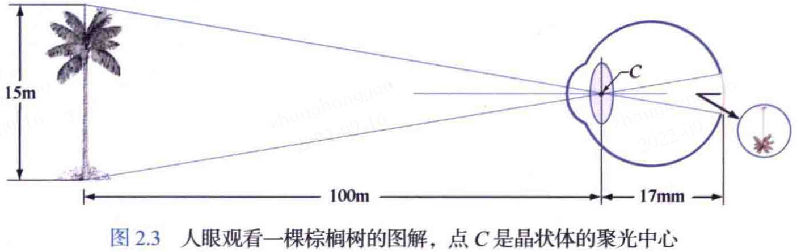

#### 1.1.3，亮度适应与辨别

以下两种现象表明人眼的感知亮度不是十几灰度的简单函数：
- “下冲”或“上冲”现象（马赫带效应）。
- 同时对比现象。

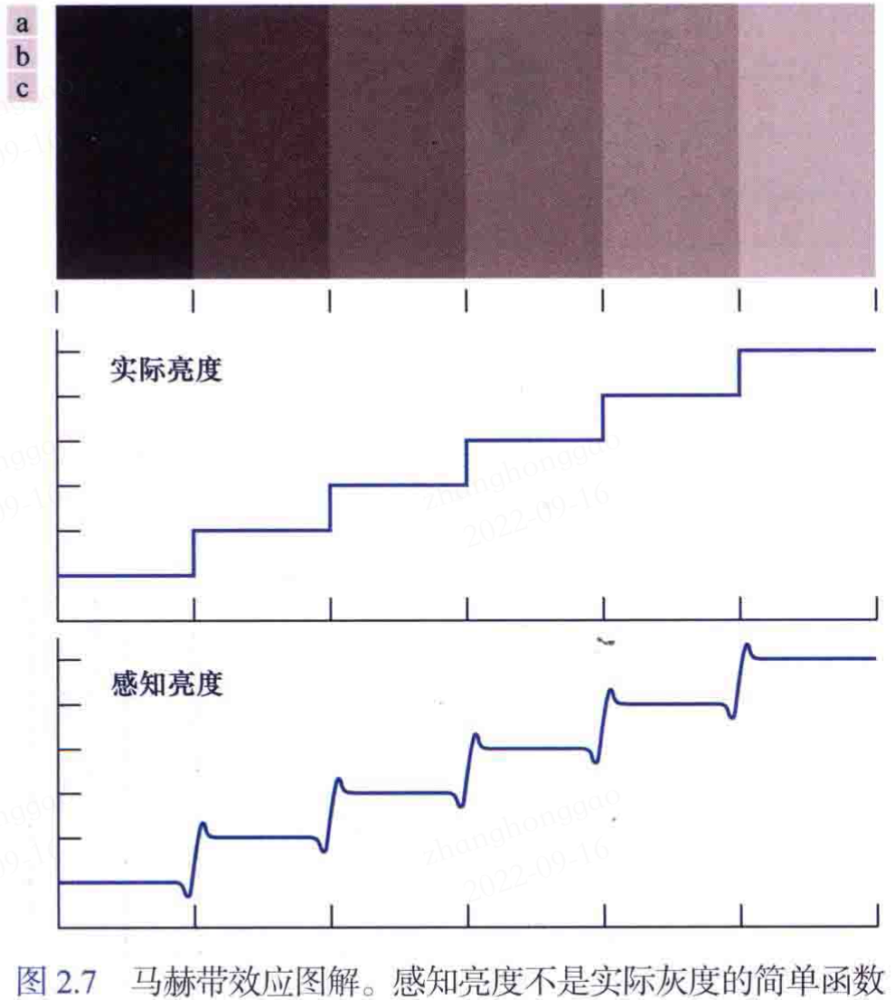

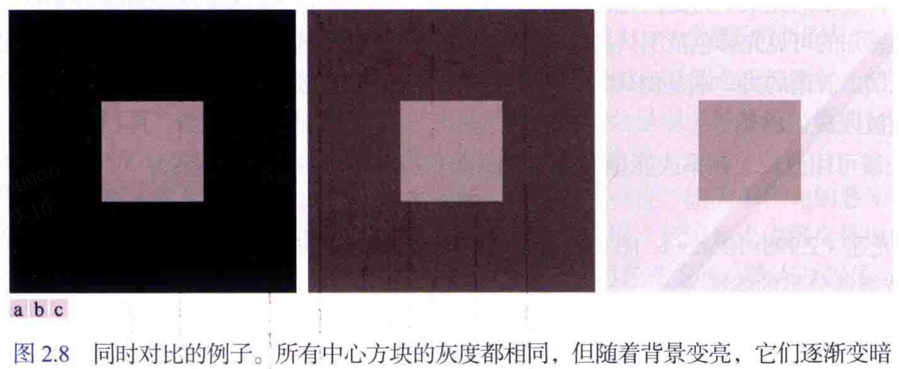

### 1.2，电磁波谱

更详细的电磁波谱图如下图所示。波长常用的单位是米（m），常用的单位是微米（表示为 $\mu m$， $1\mu m=10^{-6}m$）。

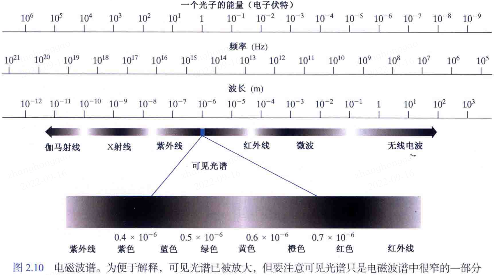

- 感知的物体颜色由物体反射的光的性质决定。
- 没有颜色的光称为**单色光或无色光**。
- 彩色光源的三个属性：频率、辐射、光通量和**亮度**。

### 1.3，图像感知与获取

将照射能量转换为数字图像主要由三种传感器配置：
- 使用单个传感器获取图像
- 使用条带传感器获取图像：如磁共振成像（MRI）和正电子发射断层成像（PET）等。
- 使用阵列传感器获取图像: 如单反相机和手机相机。

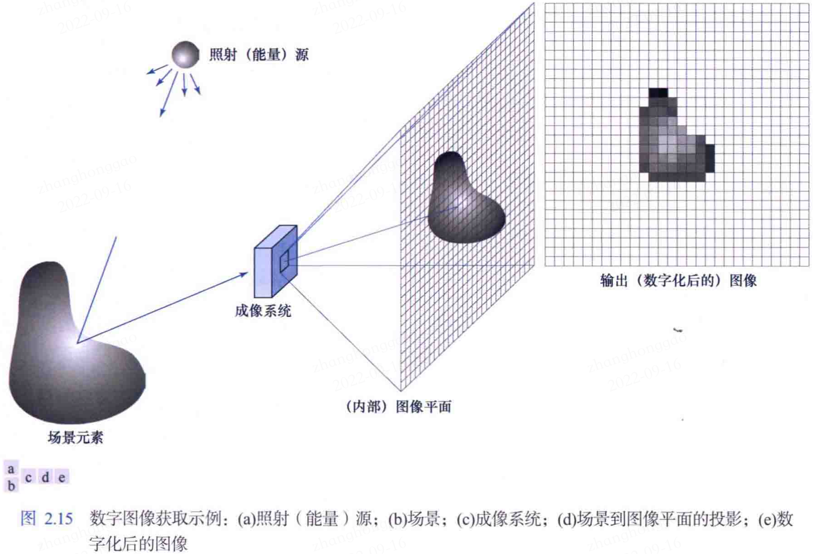

#### 1.3.1，一个简单的成像模型

如 1.1 节所述，我们用形如 $f(x,y)$ 的**二维函数**来表示图像，在空间坐标 (x,y) 处 $f$ 的值是一个标量，其范围 $0\leq f(x,y) < \infty$。

### 1.4，图像取样和量化

多少传感器的输出都是**连续**的电压被判刑，这些波形的幅度和空间特性都与正被感测的物理现象相关。要产生一幅数字图像，就需要把感测得到的连续数据转化为数字形式，这包括两个步骤：**取样和量化**。

#### 1.4.1，取样和量化的概念

一幅连续图像 $f$，对坐标值进行数字化称为**取样**（或采样），对幅度值进行数字化称为**量化**。
#### 1.4.2，数字图像表示

在计算机中，数字图像可用一个 $M\times N$矩阵表示，图像长为 $M$，宽为 $N$，矩阵中的每个元素即为图像的像素。

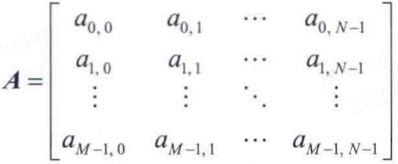

### 1.5，像素间的一些基本关系

- 像素的相邻像素
- 邻接、连通、区域和边界
- 距离测度：两个像素的距离，通过欧几里得（欧式）距离计算：$D(p,q) = \sqrt{[(x-u)^2 + (y-v)^2]}$
### 1.6，数字图像处理所用的基本数学工具

#### 1.6.1，对应元素运算和矩阵运算

涉及一幅或多幅图像的对应元素运算是逐个像素操作的，有因为在数字图像处理中，图像可以等效为矩阵，所以**图像之间的运算是可以用矩阵理论执行的**。

#### 1.6.2，线性运算和非线性运算（一般两个图像之间）

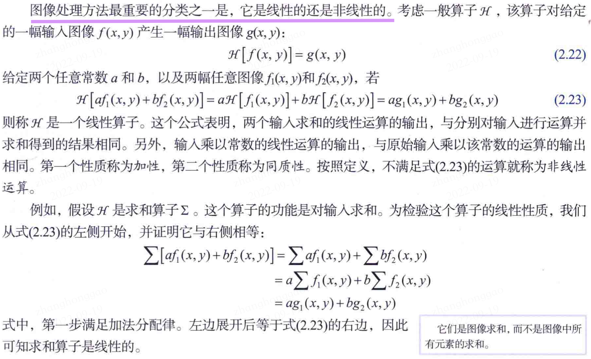

线性运算更为重要，包含了大量适用于图像处理的理论与实践成果；非线形运算范围比较有限。
#### 1.6.3，数字图像处理数学工具-算术运算（一般两个图像之间）
算术运算常用在特定的天文、医学等领域，将两幅图像经过算术运算从而得到更为清晰的图像，两幅图像的算术运算表示如下：

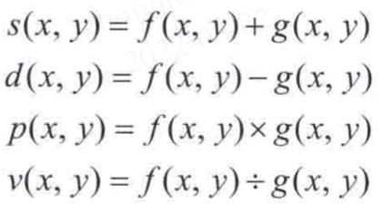

这些加减乘除运算都是对应的像素运算，算术运算一般有以下应用：

1. 使用图像相加（平均）降低噪声。
1. 使用图像相减比较图像。
3. 使用图像相乘/相除校正阴影和模板。

`3` 种算法运算的实际应用效果对比图如下所示：

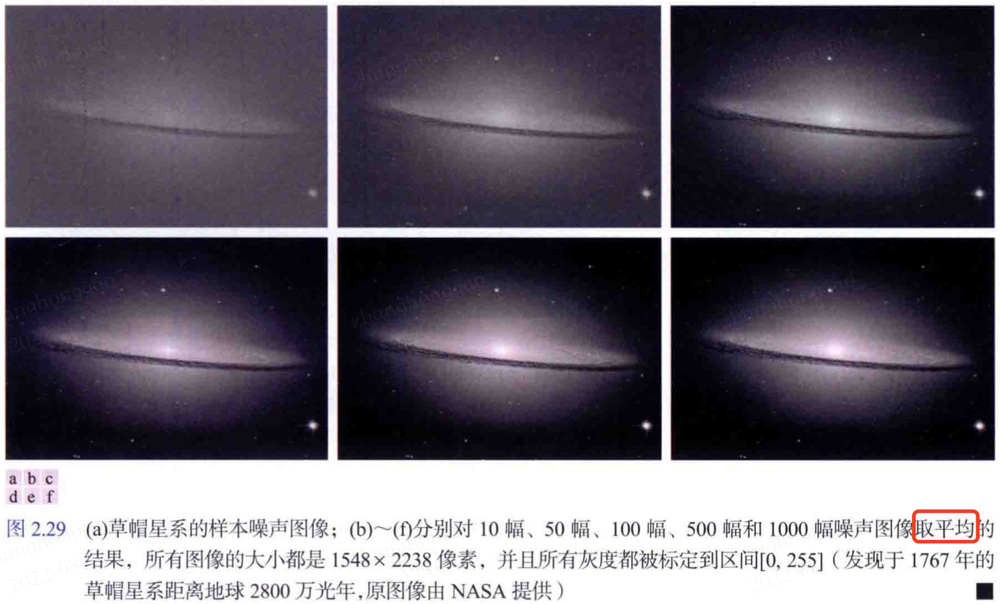

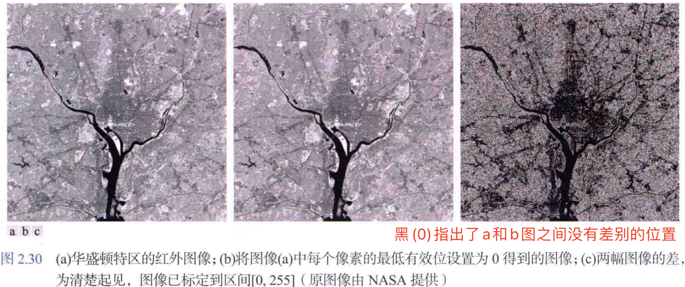

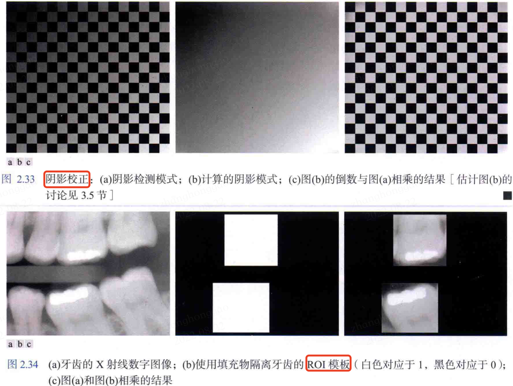

#### 1.6.4，集合运算和逻辑运算（一般两个图像之间）
**注意这里的集合运算针对的是二值图像，或者图像中所有像素具有相同的灰度值且**。

假设有两个集合 A 和，在数字图像处理中常见的集合运算有：
- 交集运算: $C = A\cap B$，满足交换律、结合律和分配律。
- 并集运算: $C = A\cup B$。

如果想要知道一幅**二值**图像中的两个目标 A 和 B 是否重叠，可通过计算 A\cap B$。如果结果不是空集，则可确定两个目标的某些元素是有重叠的。
#### 1.6.5，空间运算（单幅图像）

空间运算是直接对单幅图像的像素执行数学操作，分为三类：（1）单像素运算；（2）领域运算；（3）几何空间运算。

##### 1.6.5.1，单像素操作
用一个变化函数T改变图像中各个像素的灰度: 

$s = T(z)$

上述公式对应单像素操作，z是原图像中像素的灰度，s是处理后图像中对应像素的（映射）的灰度。

##### 1.6.5.2，领域运算
令 $S_{xy}$ 代表图像 $f$中以任意一点 (x,y) 为中心的一个邻域的做标集，领域处理后，输出图像$g$中的相同坐标处会生成一个新的像素，该像素的值由输入图像中邻域像素的规定运算和集合$S_{xy}$中的坐标确定。假设**领域运算**对应的是计算大小为$m\times n$、中心为$(x,y)$的矩形领域中像素的平均值，且这个区域中的像素坐标是集合$S_{xy}$的元素，那么其对应的领域运算公式如下：

$$g(x,y) = \frac{1}{mn} \sum_{(r,c)\in S_{xy}}f(r,c)$$

上述公式中，r和c是像素的行和列坐标，属于集合$S_{xy}$，图像g是通过移动坐标(x,y)，使得领域的中心逐个移过图像f中的所有像素，然后在每个新位置都重复这一**领域运算**得到，对应的示意图如下：

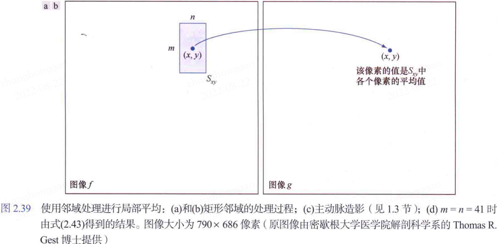

简单理解所谓的领域运算就是对特定 roi 区域的所有像素，做特定操作，而这个操作就是以指定位置 (x,y) 为中心，邻域范围为 $m\times n$，对这个范围内的像素取平均/求和/最大值/等。
> 典型的就是 `CNN` 模型中卷积层的滤波器操作。

##### 1.6.5.3，几何变换
**几何变换即改变图像中像素的空间排列**，由两种基本运算组成：

1. 坐标的空间变换；
1. 灰度内插，即为变换后的像素赋灰度值（灰度图）。

坐标变换公式可表示为：

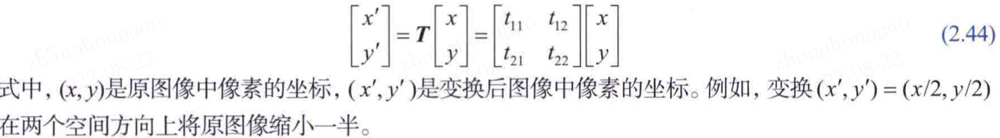

最为重要的是**放射变换**，它包括**缩放变换、平移变换、旋转变换和剪切变换**。式(1.44)无法表示平移变换（需要在公式右侧添加一个常数二维向量），所以需将上式升级为，如下所示的齐次坐标变换。

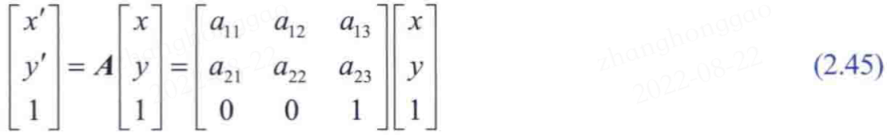

常见图像几何操作对应的仿射矩阵 `A` 、变换坐标公式以及示意图如下表所示：

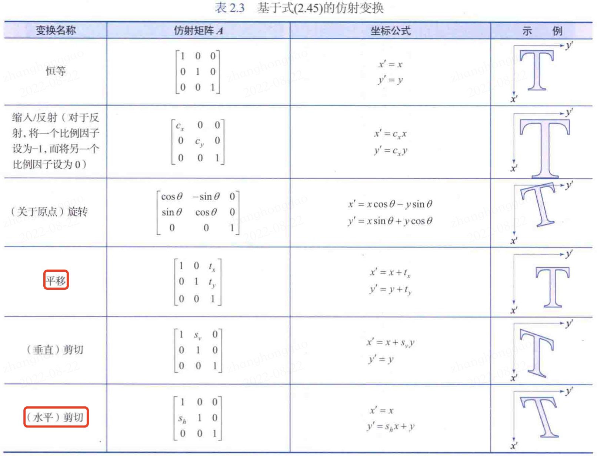
